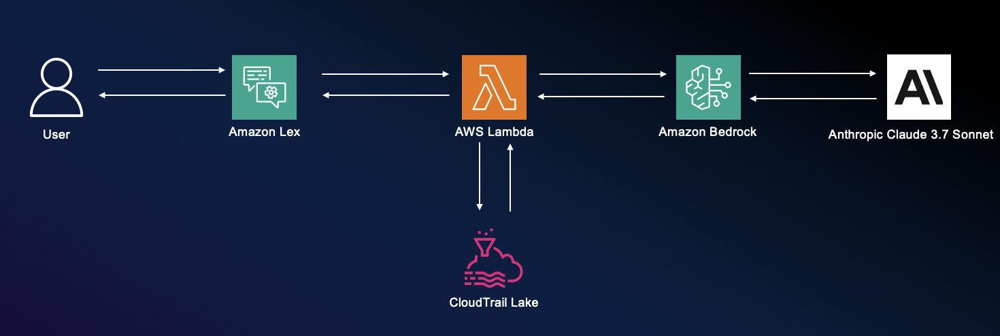
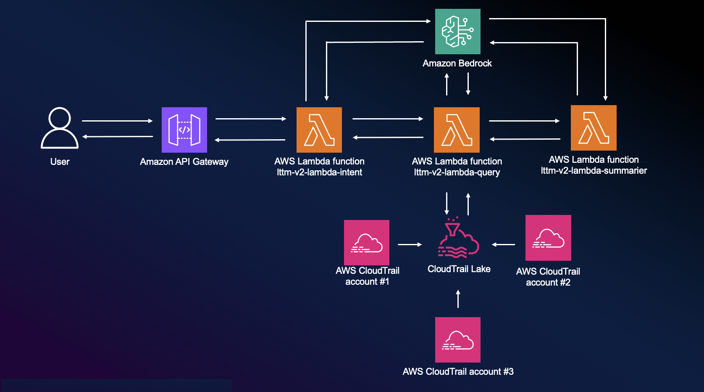
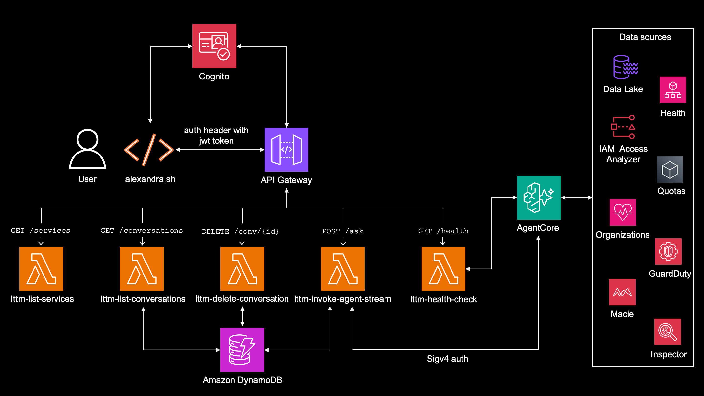

<!-- Copyright (c) 2026 Michal Salanci -->
<!-- SPDX-License-Identifier: MIT -->

# Logs talk to me
This is the bot you can chat with, about your AWS environment.

Currently there are 3 versions available to fork and work with.
v1 - using Amazon Lex, single AWS Lambda function and Amazon Bedrock on 1 ivocation - **reading CloudTrail only**
v2 - using AWS API Gateway, 3 AWS Lambda functions and Amazon Bedrock on 3 separate invocations - **reading CloudTrail only**
v3 - reading multiple datasources and using AI agents - **Reading multiple sources**

All versons using local script `alexandra.sh` to interconnet between user's CLI and AWS

---

## LTTMv1 - Lex, Lambda, Bedrock



### Introduction to LTTMv1
LTTMv1 was moved to sepparate branch https://github.com/msalanci/logs_talk_to_me/tree/v1

This version is using **Amazon Lex** to: 
- Get the intent of the user's question
- Get the summary response from Lambda function and forwards it back to the user.

It also uses **AWS Lambda function** to: 
- Create SQL query
- Query the CloudTrail Event Data Store
- Send query output to Bedrock model for summary
- Wait for Bedrock response and forward it to Lex

### Deployment
using **CloudFormation**

---

## LTTMv2 - API GW, Lambdas, Bedrock



### Introduction to LTTMv2
LTTMv2 was moved to sepparate branch https://github.com/msalanci/logs_talk_to_me/tree/v2

This is more robust version than v1.
The main differences against v1 are:
- **Intent**, **SQL query** and **summarization** arw being done by sepparate AWS lambda functions.
- **No Amazon Lex** is used - for Intent we are now using Amazon Bedrock model


### Architectural overview

LTTMv2 uses API GW, 3 Lambda functions, each invoking Amazon Bedrock sepparately.

AWS Lambda function `lttm-v2-lambda-intent`:
- Is invoked by **API Gateway**.
- Reads the the user's question (input) and parsing it to appropriate format.
- Injects the input into a promt and send to **Amazon Bedrock model** to get the intent.
- Receives the intent from **Amazon Bedrock model** and sends it to AWS Lambda Function `lttm-v2-lambda-query`.
- Sends the final summary forwarded from AWS Lambda function `lttm-v2-lambda-query` back to **API Gateway**.

AWS Lambda function `lttm-v2-lambda-query`:
- Is invoked by **AWS Lambda function** `lttm-v2-lambda-intent`.
- Receives the original user input and intent from AWS Lambda function `lttm-v2-lambda-intent`.
- Parses all the data to appropriate format, injects into a prompt and sends to **Amazon Bedrock model** to determine the SQL query.
- Receives the SQL query created by **Amazon Bedrock model** and queries **CloudTrail Data Event Store**.
- Receives the SQL query output and sends it to AWS Lambda function `lttm-v2-lambda-summarizer`.
- Receives the final summarization from AWS Lambda function `lttm-v2-lambda-summarizer` and forwarding it to `lttm-v2-lambda-intent`.

AWS Lambda function `lttm-v2-lambda-summarizer`:
- Is invoked by AWS Lambda function `lttm-v2-lambda-query`.
- Receives original user's input and query output from AWS Lambda function `lttm-v2-lambda-query`.
- Determines the user's style (standard, funny, kids), injects all the data into prompt and sends to **Amazon Bedrock model** to explain the SQL query output.
- Receives the **Amazon Bedrock model** output and forwards it to AWS Lambda function `lttm-v2-lambda-query`, which then forwards it to AWS Lambda function `lttm-v2-lambda-intent`, which then forwards it to AWS API Gateway, from where it gets to the user.


### Deployment
with **CloudFormation** either:
- using `deploy_cf.sh` script, directly from CLI 
- manual deployment in CloudFormation console

---

## LTTMv3 - AgentCore, Strands Agents, Athena Data Lake



### Introduction to LTTMv3
LTTMv3 lives on a sepparate branch https://github.com/msalanci/logs_talk_to_me/tree/v3

This is a full rewrite of the project. Instead of Lambda functions calling Bedrock directly, v3 uses **AI agents** running on **Amazon Bedrock AgentCore Runtime** with the **Strands Agents SDK**.

The main differences against v1 and v2 are:
- **No more single-purpose Lambdas** for intent/query/summarization — a **supervisor agent** (Claude Sonnet 4) routes questions to **12 specialized sub-agents** that handle different AWS data sources.
- **Multi-source data lake** — not just CloudTrail anymore. The system queries CloudTrail, CloudWatch Logs, AWS Config, Cost and Usage Reports (CUR), VPC Flow Logs, and GuardDuty findings via **Amazon Athena** over an **S3 data lake**. Six additional services (Macie, Inspector, Access Analyzer, Health, Organizations, Service Quotas) are queried via direct AWS API calls.
- **Multi-account** — data spans 3 AWS accounts in one AWS Organization (main, dev, prod). Sub-agents assume cross-account roles to read account-local services.
- **Streaming SSE** — responses stream in real-time via Server-Sent Events. The user sees status updates ("⏳ Athena query executing...") as they happen, not a blank screen for 60 seconds.
- **Conversation memory** — AgentCore Memory (STM + LTM) persists context across invocations. Follow-up questions work without repeating context.
- **Anti-hallucination guardrails** — 7 layers of defense: deterministic SQL validation hooks, LLM-as-judge steering (Haiku 4.5), output integrity checks, architecture guard, Bedrock managed guardrail, SQL rewrite hook, and LIMIT enforcement.

### Architectural overview

```text
User / alexandra.sh
        ↓ Cognito JWT
API Gateway REST API (eu-central-1, REGIONAL, streaming)
        ↓ InvokeWithResponseStream
Node.js lambnda function `lttm-invoke-agent-stream` (response streaming)
        ↓ SigV4 InvokeAgentRuntime
Amazon Bedrock AgentCore Runtime (us-west-2)
        ↓
Supervisor Agent (Claude Sonnet 4)
        ↓ routes to 1 or more sub-agents
12 Sub-agents → Athena (S3 data lake) or AWS APIs
```

The **Node.js lambnda function `lttm-invoke-agent-stream`** exists only because Lambda response streaming (`awslambda.streamifyResponse`) requires Node.js. It's a thin shim — receives the request, calls AgentCore, pipes the SSE stream back through API Gateway to the client.

The **supervisor agent** receives the user's question, decides which sub-agent(s) to call (CloudTrail, CloudWatch, Config, CUR, Flow Logs, GuardDuty, Macie, Inspector, Access Analyzer, Health, Organizations, or Quotas), waits for results, and synthesizes a plain-English answer.

Each **sub-agent** generates SQL (for Athena-based sources) or calls AWS APIs directly, formats the results, and returns them to the supervisor.

### Deployment
with **Terraform** (infrastructure) + **AgentCore CLI** (agent runtime):
- `terraform apply` in the `terraform/` directory deploys all AWS infrastructure (API Gateway, Lambda, Cognito, S3, Glue, Athena, DynamoDB, IAM roles, cross-account roles)
- `agentcore launch` in the `agents/` directory deploys the supervisor and sub-agents to Bedrock AgentCore Runtime
